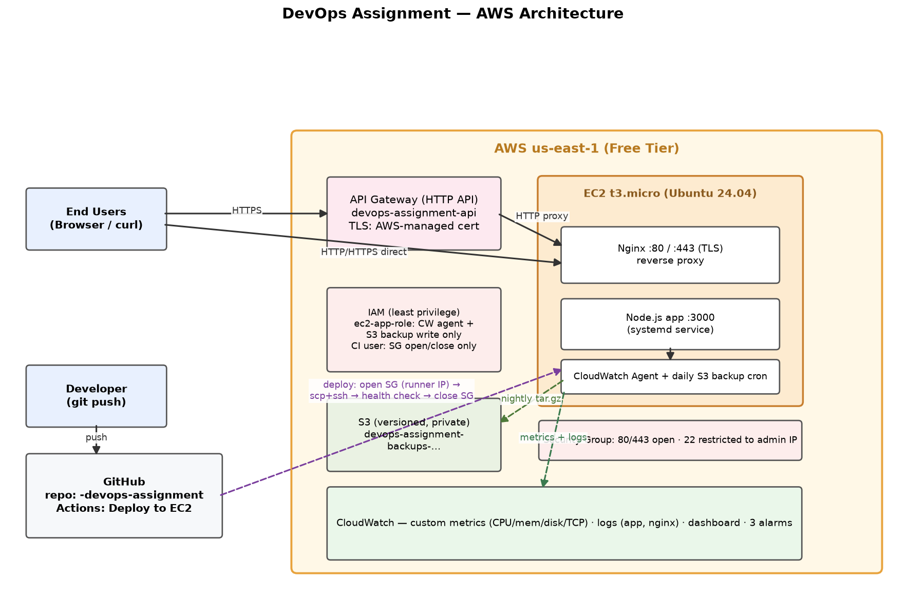

# DevOps Assignment — AWS Deployment

Production-like Node.js app on AWS Free Tier: EC2 + Nginx (HTTP/HTTPS) + API Gateway, automated CI/CD via GitHub Actions, CloudWatch monitoring/alarms/logs, S3 backups, and a Locust load test — all documented below.

## Live endpoints

| Channel | URL |
|---|---|
| Direct HTTP | http://54.80.171.245/ |
| Direct HTTPS (self-signed) | https://54.80.171.245.nip.io/ |
| API Gateway (trusted TLS) | https://tunjy62f54.execute-api.us-east-1.amazonaws.com/ |

## Repository map

| Path | Contents |
|---|---|
| [`server.js`](server.js) / [`deploy.sh`](deploy.sh) | The app and its on-instance deploy script |
| [`.github/workflows/deploy.yml`](.github/workflows/deploy.yml) | CI/CD pipeline (test → temp SSH allow → scp/ssh deploy → health check → revoke) |
| [`docs/DEPLOYMENT_GUIDE.md`](docs/DEPLOYMENT_GUIDE.md) | Full infrastructure + rebuild guide, troubleshooting notes |
| [`docs/SECURITY_SUMMARY.md`](docs/SECURITY_SUMMARY.md) | Security controls, least-privilege IAM design, known gaps |
| [`loadtest/`](loadtest/) | Locust scenario, CloudWatch collector, graph generator |
| [`loadtest/LOAD_TEST_REPORT.md`](loadtest/LOAD_TEST_REPORT.md) | Results: 11,978 reqs, 0% errors, p95 320 ms, graphs + bottleneck analysis |

## Highlights

- **CI/CD**: push to `main` → syntax test → deploy → automated health check. SSH port is opened *only* for the runner's IP during deploy and always revoked after.
- **Security**: SG allows just 80/443 publicly; SSH locked to admin IP; three least-privilege IAM principals (instance role, CI user, admin); private versioned S3 bucket.
- **Monitoring**: CloudWatch agent ships CPU/mem/disk/TCP metrics + app/nginx logs; dashboard `DevOpsAssignment-Dashboard`; alarms on high CPU, high memory, failed status checks.
- **Load tested**: 100 concurrent users, 0 errors, 3.3% peak CPU — analysis and optimization recommendations in the report.
