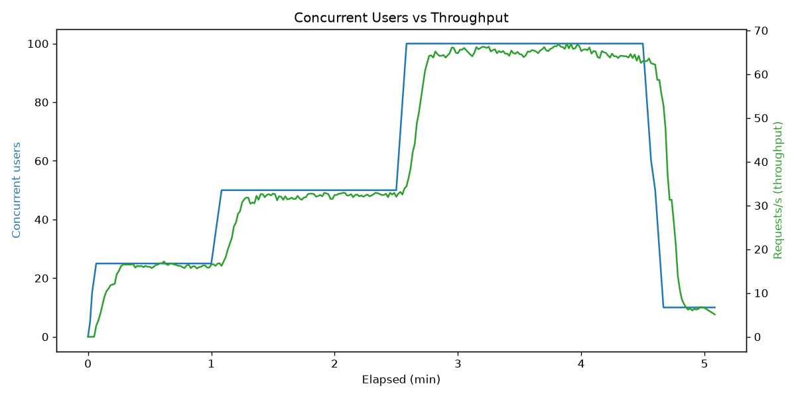
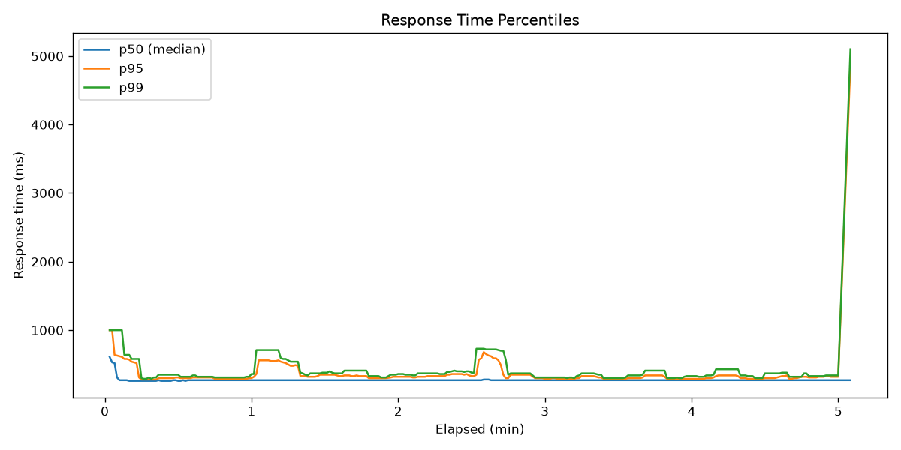
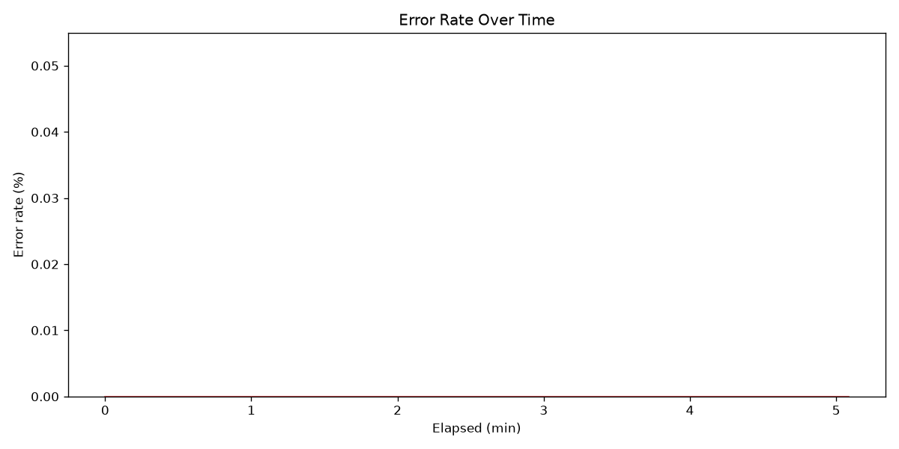
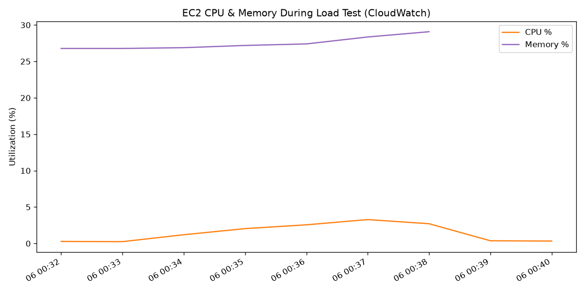

# Load Testing Report

**Tool:** Locust 2.44.4 (headless, staged load shape)
**Target:** `http://54.80.171.245/` (Nginx → Node.js on EC2 t3.micro, us-east-1)
**Test window (UTC):** 2026-07-05 19:03:32 → 19:08:57 (~5.5 min)
**Load profile:** ramp 25 users (1 min) → 50 users (1.5 min) → 100 users (2 min) → ramp-down 10 users
**Load generator:** local machine (India) → us-east-1, so figures include real internet RTT (~250 ms baseline)

## Results summary

| Metric | Value |
|---|---|
| Total requests | 11,978 |
| **Error rate** | **0.00%** (0 failures) |
| Peak throughput | ~65 req/s @ 100 users |
| Sustained average | 39.3 req/s |
| Median (p50) response | 270 ms |
| p95 / p99 | 320 ms / 490 ms |
| Max response | 5,073 ms (single outlier during teardown) |
| **Peak EC2 CPU** | **3.3%** |
| EC2 memory | ~31% steady, no growth |

## Graphs

| | |
|---|---|
|  |  |
|  |  |

(Full interactive charts: `results/report.html`, raw data: `results/*.csv`)

## Observations

1. **Throughput scaled linearly with users** (17 → 33 → 65 req/s at 25 → 50 → 100 users) with no plateau — the server was never the limiting factor at this load.
2. **Response times were flat (~270 ms) at every stage.** The floor equals the network round-trip from the load generator to us-east-1; server processing adds only a few ms. Brief p95/p99 bumps (~600–700 ms) appear exactly at ramp transitions while new TCP/TLS connections are established, then settle immediately.
3. **Zero errors across 11,978 requests**, including the 100-user stress stage.
4. **The instance loafed:** 3.3% peak CPU, stable memory, no queueing signs. The single 5 s outlier occurred at test teardown (connections being torn down), not under steady load.

## Bottleneck analysis

At this scale the bottleneck is **client-side network latency, not the server**. Extrapolating from CPU headroom (3.3% at 65 req/s), this single t3.micro could plausibly serve **hundreds of req/s** of this payload before CPU saturation; the realistic first limits would be:

1. **Nginx/kernel connection limits** (default `worker_connections 768`) — first thing to tune at higher concurrency.
2. **t3.micro CPU credits** — sustained high CPU would exhaust burst credits and throttle to 10% baseline; watch `CPUCreditBalance`.
3. **Single Node.js process** — one event loop, one vCPU used; CPU-bound work would serialize.

## Optimization recommendations

- **Enable nginx keepalive to upstream** (`upstream` block + `keepalive 32`) and raise `worker_connections` — cheapest win for high concurrency.
- **Run Node in cluster mode** (or PM2 cluster) to use both t3.micro vCPUs.
- **Add response caching/CDN** (CloudFront) for static payloads — would cut both latency (edge PoPs) and origin load.
- **For real horizontal scale:** ALB + Auto Scaling Group of t3.micros behind it; health checks already exist.
- **Monitoring guardrail:** alarm on `CPUCreditBalance < 50` to catch burst-credit exhaustion before throttling.
